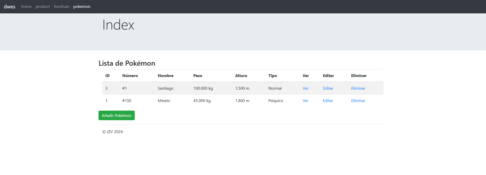
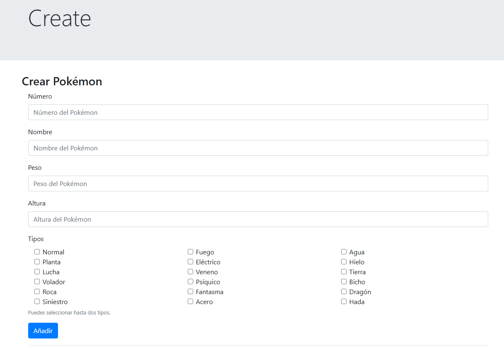
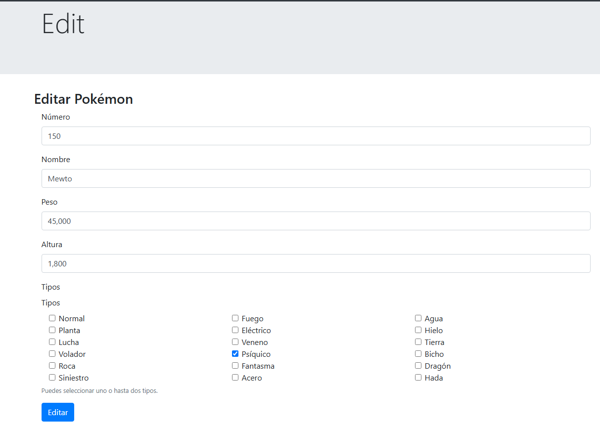
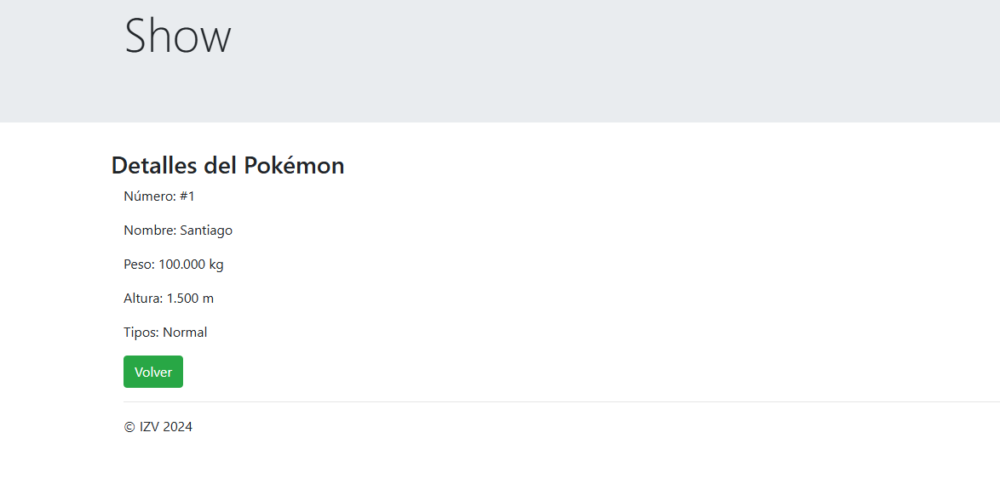

# Laravel Pokémon App


## Funciones

- Lista de Pokémon: Visualiza un listado completo de los Pokémon almacenados en la base de datos.

- Crear Pokémon: Agrega nuevos Pokémon con sus respectivos atributos como nombre, tipo, y nivel.

- Editar Pokémon: Modifica los datos existentes de cualquier Pokémon.

- Ver Pokémon: Consulta detalles específicos de un Pokémon.

- Eliminar Pokémon: Borra un Pokémon del sistema.

## Capturas de Pantalla

### Lista de Pokémon
Puedes ver una lista completa de todos los Pokémon registrados. 


### Crear Pokémon
Proporciona un formulario para agregar un nuevo Pokémon. 


### Editar Pokémon
Edita la información de un Pokémon existente.


### Ver Pokémon
Consulta todos los detalles de un Pokémon en una vista dedicada.


## Instalación

Para poner en marcha la aplicación, sigue estos pasos:

1. **Clona el repositorio:**
    ```bash
    git clone https://github.com/Santivr23/pokemonApp.git
    cd pokemonApp
    ```

2. **Instala las dependencias:**
    ```bash
    composer install
    ```

3. **Copia el archivo `.env` de ejemplo:**
    ```bash
    cp .env.example .env
    ```

4. **Genera la clave de la aplicación:**
    ```bash
    php artisan key:generate
    ```

5. **Modificar la configuración a la base de datos en el archivo `.env`.**

6. **Ejecuta las migraciones de la base de datos:**
    ```bash
    php artisan migrate
    ```
