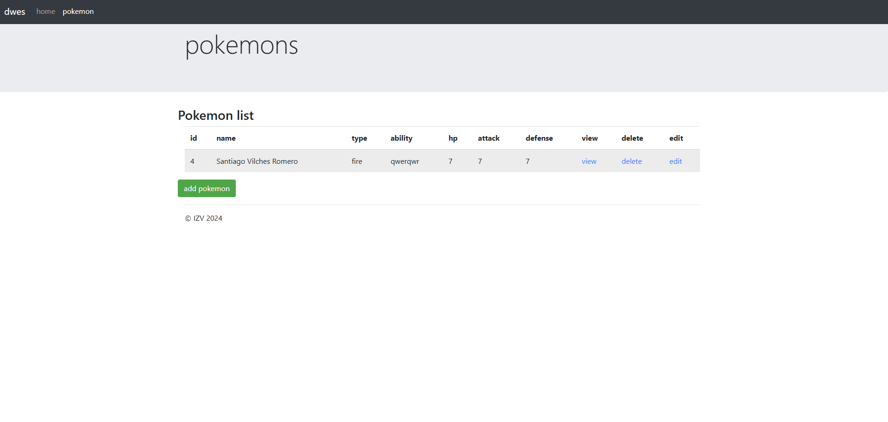
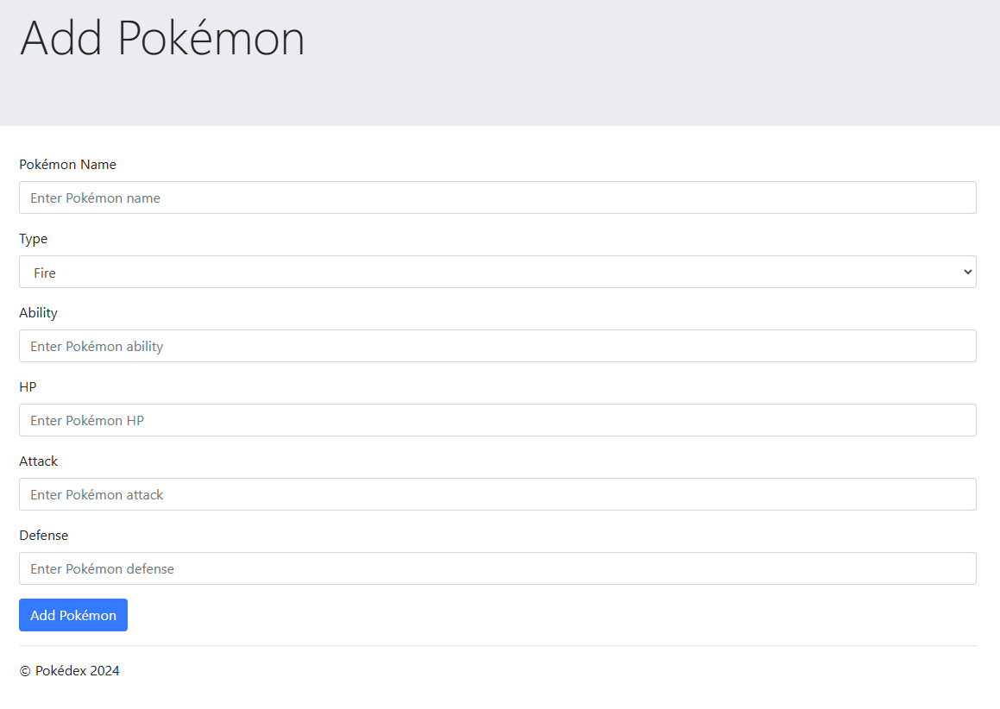
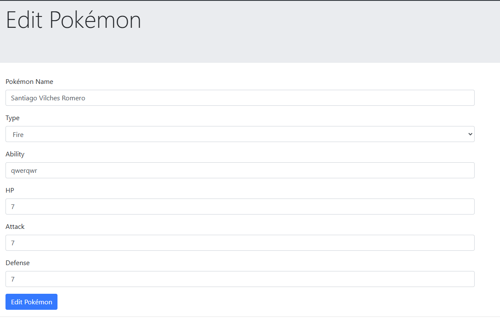
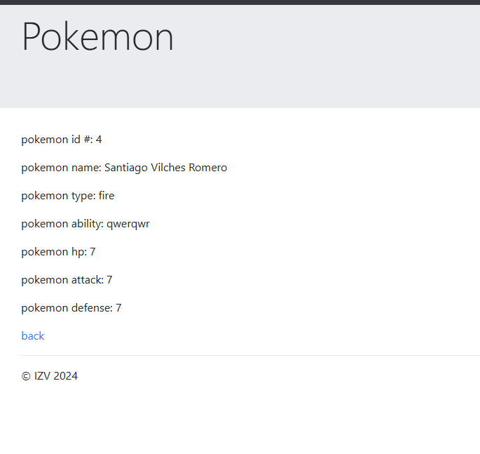

# Pokémon App

Este proyecto es una aplicación web desarrollada con PHP que permite gestionar una lista de Pokémon.

## Funcionalidades

- **Listado de Pokémon**: Muestra una tabla con todos los Pokémon registrados.
- **Crear Pokémon**: Permite añadir un nuevo Pokémon a la base de datos.
- **Editar Pokémon**: Permite modificar los datos de un Pokémon existente.
- **Eliminar Pokémon**: Permite eliminar un Pokémon de la base de datos.
- **Ver Detalles de Pokémon**: Muestra los detalles de un Pokémon específico.

## Capturas de Pantalla

### Listado de Pokémon

### Crear Pokémon

### Editar Pokémon

### Ver Detalles de Pokémon

