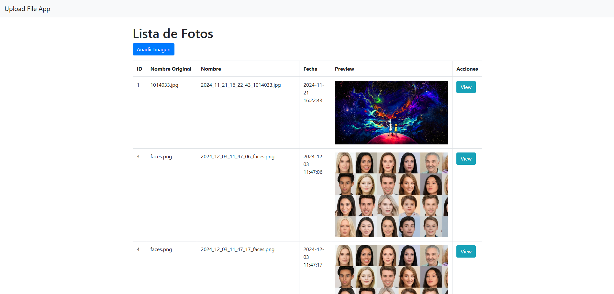

# Laravel Image Upload App

Una aplicación que permite subir y gestionar imágenes de manera fácil y eficiente utilizando Laravel. Este proyecto ofrece una interfaz intuitiva para cargar y visualizar imágenes.

## Funciones
- **Subir Imágenes**: Permite a los usuarios cargar imágenes desde sus dispositivos.
- **Visualizar Imágenes**: Muestra una galería con las imágenes subidas.

## Capturas de Pantalla

### Galería de Imágenes


### Subir Imagen


### Vista Detallada


## Subir Imágenes

Los usuarios pueden seleccionar imágenes desde su dispositivo y cargarlas al servidor. Los formatos soportados incluyen:

- **JPG**
- **PNG**
- **GIF**

## Galería de Imágenes

La galería muestra todas las imágenes subidas, permitiendo a los usuarios desplazarse fácilmente entre ellas. Cada imagen incluye opciones para verla en detalle.

## Tecnologías Utilizadas

- **Laravel**: Framework principal para la construcción de la aplicación.
- **Bootstrap**: Para un diseño de interfaz responsivo y amigable.
- **MySQL**: Base de datos para almacenar información sobre las imágenes.
- **Intervention Image**: Librería para manipular y redimensionar imágenes.

---

## Instalación

Para poner en marcha la aplicación, sigue estos pasos:

1. **Clona el repositorio:**
    ```bash
    git clone https://github.com/Santivr23/uploaadFileApp.git
    cd uploaadFileApp
    ```

2. **Instala las dependencias:**
    ```bash
    composer install
    ```

3. **Copia el archivo `.env` de ejemplo:**
    ```bash
    cp .env.example .env
    ```

4. **Genera la clave de la aplicación:**
    ```bash
    php artisan key:generate
    ```

5. **Modificar la configuración a la base de datos en el archivo `.env`.**

6. **Ejecuta las migraciones de la base de datos:**
    ```bash
    php artisan migrate
    ```


